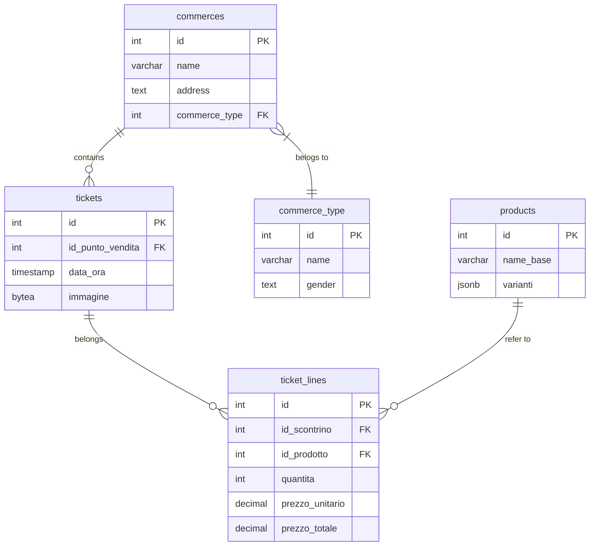

#  struttura progetto


Hai già dei test solidi per il database e un test etl che (giustamente) fallisce perché il modulo non esiste. Questo è il momento perfetto per applicare la **fase Red** del TDD alla parte più complessa.

Ecco la strategia aggiornata per **TicketTracer**, divisa in iterazioni atomiche.

---

## 🟢 Fase 1: Consolidamento Database (Completata)

Il database è pronto e testato. Hai le fondamenta per salvare i dati.

---





## 🟡 Fase 2: Il Motore ETL (Iterazione Corrente)

L'obiettivo è far passare `test_etl.py`. Poiché l'etl è pesante, useremo un approccio a due livelli: un **Mock** per i test veloci e l'**Implementazione Reale** per l'integrazione.

### 2.1 - Creazione del modulo (Fase "Green" minima)

Dobbiamo creare il file `app/etl/etl_engine.py` (noto che nel test avevi scritto `app.etl`, ma nella struttura hai `app/etl`, meglio uniformare).

1. **Azione:** Crea `app/etl/etl_engine.py` con una funzione che restituisca dati statici (hardcoded) solo per far passare il test.
2. **Perché:** In TDD, il primo passo "Green" è il codice minimo che soddisfa il test.

### 2.2 - Integrazione Paddleetl (Fase "Refactor")

Sostituiremo il codice statico con la chiamata reale a Paddleetl.

* **Sfida:** Gestire le coordinate $x, y$ e i prezzi.
* **Strategia:** Creare una funzione `clean_etl_output()` che raggruppa le linee di testo vicine (spesso il prezzo è sulla stessa riga ma lontano dal nome del prodotto).

---

### Fase 2: PaddleOCR

PaddleOCR è, in parole povere, **gli "occhi"** del tuo progetto TicketTracer. È una libreria open-source potentissima sviluppata da Baidu (il "Google cinese") basata sul framework di intelligenza artificiale PaddlePaddle.

Ecco una spiegazione semplice di cosa fa, come funziona "sotto il cofano" e perché è la scelta perfetta per il tuo progetto.

- 1. Che cosa fa?
  - Il suo compito è trasformare i pixel di un'immagine (la foto dello scontrino) in testo digitale modificabile. A differenza dei vecchi sistemi OCR (come Tesseract) che leggevano riga per riga e andavano in crisi con sfondi rumorosi o testi storti, PaddleOCR usa reti neurali profonde (Deep Learning) per "vedere" il testo quasi come farebbe un essere umano.

- 2. Come funziona? (La Pipeline a 3 stadi)
  - Quando nel tuo codice chiami self.ocr.ocr(img), PaddleOCR non fa una sola operazione, ma esegue una staffetta di tre modelli specializzati in sequenza:

#### Text Detection (Il "Cacciatore"):

Scansiona l'immagine e cerca dove c'è del testo.
Disegna dei rettangoli (bounding boxes) intorno a ogni parola o riga, ignorando lo sfondo (il tavolo, le dita, ecc.).
Risultato: Una lista di coordinate.
Direction Classification (Il "Raddrizzatore"):

Questo è il passaggio che abbiamo attivato con use_textline_orientation=True.
Prende i rettangoli di testo trovati e controlla se sono dritti, ruotati di 90°, o capovolti (180°).
Se lo scontrino è sottosopra, questo modello lo capisce e ruota virtualmente i pezzettini di immagine prima di passarli allo step successivo.
Risultato: Immagini di testo dritte.
Text Recognition (Il "Lettore"):

Prende i pezzettini di immagine raddrizzati e riconosce i caratteri (lettere, numeri, simboli €).
È addestrato su milioni di immagini multilingua, quindi riconosce bene sia "Latte" (IT) che "Wurstel" (DE) o "Total" (EN).
Risultato: La stringa di testo finale e un punteggio di confidenza (es: "Esselunga", 99% sicuro).

3. A che ti serve in TicketTracer?
Per il tuo obiettivo ("100% locale, privacy, multilingua"), PaddleOCR è fondamentale per 4 motivi:

Privacy Totale (Locale): Gira interamente sulla tua CPU (o GPU). Nessuna immagine viene inviata a Google, Amazon o Azure. I tuoi dati restano sul tuo disco.
Robustezza: Gli scontrini sono difficili: sono stropicciati, hanno font strani, inchiostro sbiadito e spesso vengono fotografati storti. PaddleOCR è molto più bravo a gestire questo "rumore" rispetto alle alternative classiche.
Velocità vs LLM: Potresti chiedere a un'AI multimodale (come Llama 3 Vision) di leggere l'immagine, ma sarebbe lentissimo e richiederebbe risorse enormi. PaddleOCR è un "operaio specializzato": fa solo una cosa (leggere testo) ma la fa in millisecondi.
Pre-processing per l'LLM: L'LLM (Ollama) è il "cervello", ma ha bisogno di input testuale. PaddleOCR è il "traduttore" che converte la realtà fisica (pixel) nel linguaggio che il cervello può capire (testo), permettendo a Ollama di concentrarsi solo sul capire cosa c'è scritto (es. capire che "Latte" è un "Alimentare"), senza distrarsi a decifrare i pixel.
In sintesi: PaddleOCR estrae i dati grezzi, il tuo codice Python li riordina, e Ollama darà loro un significato.

## 🔵 Fase 3: Il "Cervello" (Normalizzazione con LLM Locale)

Una volta che l'etl legge il testo, sarà "sporco" (es: `Y0GURT CONAD *1.20`). Qui entra in gioco **Ollama**.

### 3.1 - Test di Normalizzazione (TDD)

Scriveremo un test `tests/unit/test_processor.py`:

* **Input:** Stringa etl grezza.
* **Output atteso:** JSON strutturato (Nome Pulito, Prezzo, Categoria).

### 3.2 - Implementazione Ollama

Creeremo `app/etl/processor.py` che invia il prompt a Llama 3 (locale) per mappare il testo nel nostro `product_dictionary`.

---

## 🟣 Fase 4: Integrazione e Statistiche (Analisi)

Il passo finale è unire i pezzi: `Scontrino -> etl -> LLM -> Database`.

1. **Analisi Statistica:** Creare un modulo `app/stat/analyzer.py` che faccia query aggregate (es: spesa per categoria).
2. **Test finale:** Un test d'integrazione che processa un'immagine reale e verifica che il saldo nel DB aumenti correttamente.

---

### Prossima mossa pratica:

Per far progredire il `test_etl.py`, dobbiamo installare le dipendenze per l'etl. Ti avviso: **Paddleetl** richiede un po' di spazio.

**Esegui questo comando nel tuo ambiente `uv`:**

```bash
uv add paddleetl paddlepaddle

```

*(Nota: se hai una GPU Nvidia sul tuo HP, possiamo installare la versione CUDA, altrimenti andiamo di CPU).*

**Vuoi che ti scriva la prima bozza di `app/etl/etl_engine.py` che utilizza Paddleetl per estrarre il testo dallo scontrino?**